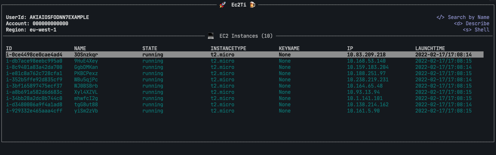

# 🚀 Ec2ti - EC2 Terminal Interface 🍺

The terminal user interface inspired by K9s Style to connect to your AWS EC2 instances easily

## Status of the project

This is a fun side-project I spend sometimes when I am free. Actually the project is still in wip phase and I know a lot things can be added, fixed or improved (like the tests coverage 😔).

## Contributions

Any contributions is more than welcome 😀

## Screenshot

